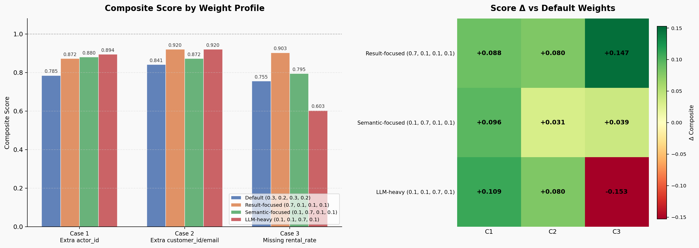

# txt2sql Benchmark Suite

Standard text-to-SQL evaluation uses two binary metrics: **Exact Match (EM)** — does the generated SQL string match the reference exactly? — and **Execution Accuracy (EX)** — do both queries return identical result sets?

These are the right metrics for leaderboards. They are the wrong metrics for iterating on a system.

When you're tuning prompts, comparing two model checkpoints, or debugging a text-to-SQL pipeline, you need to know *how wrong* a query is — not just *that* it is wrong. A query that returns the right answer plus one extra column is not the same failure as a query that hits the wrong table. Binary metrics cannot tell the difference.

This suite introduces a **composite [0, 1] score** that measures four complementary dimensions of query quality — result correctness, SQL structural similarity, LLM holistic judgment, and execution efficiency — and combines them into a single number you can track over time.

> Runs against a local SQLite [Sakila](https://github.com/jOOQ/sakila) database. The evaluation logic is database-agnostic.

---

## The Problem

Consider three real queries against the Sakila DVD rental database. The user asks a question, the LLM generates SQL, and we compare it against a reference query. All three score **EM=0, EX=0** — binary metrics say they are equally wrong.

---

### Case 1 — Extra column: unnecessary primary key

**User:** *"Show actor names who appeared in action films"*

| | SQL |
|---|---|
| **Generated** | `SELECT DISTINCT a.actor_id, a.first_name, a.last_name FROM actor a JOIN film_actor fa ON a.actor_id = fa.actor_id JOIN film_category fc ON fa.film_id = fc.film_id JOIN category c ON fc.category_id = c.category_id WHERE c.name = 'Action'` |
| **Expected** | `SELECT DISTINCT a.first_name, a.last_name FROM actor a JOIN film_actor fa ON a.actor_id = fa.actor_id JOIN film_category fc ON fa.film_id = fc.film_id JOIN category c ON fc.category_id = c.category_id WHERE c.name = 'Action'` |

The generated query returns `actor_id` alongside the requested names. The user never asked for it. The answer — the list of actor names — is there and essentially correct. Binary metrics score this **EX=0**, identical to querying the wrong table entirely.

---

### Case 2 — Extra columns: unrequested metadata

**User:** *"Get rental count per customer with their full name"*

| | SQL |
|---|---|
| **Generated** | `SELECT c.customer_id, c.first_name, c.last_name, c.email, COUNT(r.rental_id) AS rental_count FROM customer c JOIN rental r ON c.customer_id = r.customer_id GROUP BY c.customer_id` |
| **Expected** | `SELECT c.first_name, c.last_name, COUNT(r.rental_id) AS rental_count FROM customer c JOIN rental r ON c.customer_id = r.customer_id GROUP BY c.customer_id` |

The generated query includes `customer_id` and `email` — columns the user never asked for. The actual answer (full name + rental count for every customer) is **100% correct**. EX fails because the result sets have different columns. Binary sees this as a failure equivalent to Case 1.

---

### Case 3 — Missing column: incomplete answer

**User:** *"Show the title and rental rate of PG-rated films"*

| | SQL |
|---|---|
| **Generated** | `SELECT title FROM film WHERE rating = 'PG'` |
| **Expected** | `SELECT title, rental_rate FROM film WHERE rating = 'PG'` |

The generated query returns only `title`. The user explicitly asked for `rental_rate` too. This is a **genuine gap** — the answer is incomplete and would require a second query to fix. Binary scores this **EX=0**, identical to Cases 1 and 2.

---

### What binary metrics cannot express

| # | User question | Issue | EM | EX |
|---|--------------|-------|----|----|
| 1 | Actor names in action films | Extra `actor_id` — answer is essentially complete | 0 | 0 |
| 2 | Rental count per customer | Extra `customer_id`, `email` — answer is 100% correct | 0 | 0 |
| 3 | Film titles and rental rates for PG films | Missing `rental_rate` — answer is genuinely incomplete | 0 | 0 |

Three different levels of quality. One score. When two models both sit at 65% EX, you cannot tell which one is closer to being right on the remaining 35%.

As Pinna et al. (2025) note, binary metrics "fail to capture the similarities and differences between equivalent SQL queries" and "overlook critical aspects such as partial correctness, structural differences, and semantic equivalence" [[1]](#references).

---

## The Approach

This suite replaces binary pass/fail with four complementary continuous scores, then combines them into a single weighted composite.

### Step 1: Intent-Aware Column Selection

Before any metric is computed, the benchmark determines which columns actually matter for answering the user's question. An LLM examines the natural-language query alongside both SQL statements and produces a column mapping — selecting only the relevant columns from both result sets and aligning them for comparison.

This has two effects:

- **Extra columns are ignored.** In Cases 1 and 2, `actor_id`, `customer_id`, and `email` are dropped before comparison. Evaluation focuses on the columns the user asked for.
- **Missing columns surface through the judge.** In Case 3, `rental_rate` is absent from the generated result entirely. S_T has nothing to penalize — it only sees the `title` column, which matches perfectly. The LLM judge is what catches this gap and reflects it in the score.

This is the complementary relationship between S_T and LLM Score: **S_T tells you whether the rows you returned are correct; LLM Score tells you whether you returned the right columns.**

### Step 2: Four Metric Dimensions

| Metric | What it measures | Range |
|--------|-----------------|-------|
| **S_T** (Result Similarity) | Edit-distance similarity between projected result sets after intent-aware column selection | [0, 1] |
| **S_C** (Semantic Similarity) | Cosine similarity of SQL code embeddings — how structurally close the two queries are | [0, 1] |
| **LLM Score** | LLM-as-judge holistic evaluation of correctness, completeness, and intent alignment | [0, 1] |
| **VES** (Valid Efficiency Score) | Execution speed relative to the reference, awarded only when results are correct | [0, 1] |

### Step 3: Composite Score

$$\text{Composite} = W_1 \cdot S_T + W_2 \cdot S_C + W_3 \cdot \text{LLM} + W_4 \cdot \text{VES}$$

Default weights: $W_1=0.3,\ W_2=0.2,\ W_3=0.3,\ W_4=0.2$

Weights are tunable per use case. More on this [below](#tuning-weights).

---

## Benchmark Results

Running the three cases above through the suite:

**Models:** embedding — `text-embedding-qwen3-embedding-8b` · column selection + judge — `google/gemma-4-26b-a4b`

| # | User question | Issue | EM | EX | S_C | S_T | LLM | VES | **Composite** |
|---|--------------|-------|----|----|-----|-----|-----|-----|---------------|
| 1 | Actor names in action films | Extra `actor_id` | 0 | 0 | 0.977 | 0.964 | 1.000 | 0.000 | **0.785** |
| 2 | Rental count per customer | Extra `customer_id`, `email` | 0 | 0 | 0.919 | 1.000 | 1.000 | 0.284 | **0.841** |
| 3 | Film titles and rental rates | Missing `rental_rate` | 0 | 0 | 0.820 | 1.000 | 0.500 | 0.707 | **0.755** |

All three score **EM=0, EX=0**. The composite scores are **0.785**, **0.841**, and **0.755**. More importantly, each score comes from a different cause — which is the point:

**Case 1** — `actor_id` is dropped by column selection. S_T=0.964 is near-perfect (a single duplicate name pair — two actors named `SUSAN DAVIS` — causes the small gap). LLM=1.0 confirms the answer is correct. Low composite is driven entirely by VES=0, since EX fails on the raw result sets before projection.

**Case 2** — After stripping `customer_id` and `email`, the projected result is identical to the reference. S_T=1.000. LLM=1.000. This is the strongest result of the three — **EX=0, but the answer is perfect**.

**Case 3** — The `title` column matches exactly, so S_T=1.000 on what was returned. But LLM=0.500 catches what S_T cannot: `rental_rate` is simply absent. The judge penalizes the incomplete answer. **This is the only case where something genuinely needs to be fixed.**

Binary scoring sees all three as identical failures. This suite tells you which one is actually a problem.

---

## Tuning Weights

The composite formula is $W_1 \cdot S_T + W_2 \cdot S_C + W_3 \cdot \text{LLM} + W_4 \cdot \text{VES}$. Shifting weights changes what the score prioritizes.

| # | Default<br>(0.3, 0.2, 0.3, 0.2) | Result-focused<br>(0.7, 0.1, 0.1, 0.1) | Semantic-focused<br>(0.1, 0.7, 0.1, 0.1) | LLM-heavy<br>(0.1, 0.1, 0.7, 0.1) |
|---|---|---|---|---|
| 1 | 0.785 | 0.873 | 0.880 | 0.894 |
| 2 | 0.841 | 0.920 | 0.871 | 0.920 |
| 3 | 0.755 | 0.903 | 0.795 | 0.603 |

- **Result-focused** — Case 3 climbs to 0.903 because S_T=1.0 rewards the correct `title` rows. This shows the risk: high W1 cannot penalize columns that were never returned.
- **Semantic-focused** — Case 1 climbs to 0.880; its SQL is structurally very close to the reference (only `actor_id` added). Case 3 drops because the shorter `SELECT title` diverges more from `SELECT title, rental_rate`.
- **LLM-heavy** — Case 3 drops sharply to 0.603. The judge has a clear view of completeness and penalizes the missing column strongly. Best profile for catching incomplete queries.
- **Default** — balanced view. Good general-purpose starting point.



The left panel shows absolute composite scores per case under each profile. The right heatmap shows the delta versus the default — **C3 is the most weight-sensitive case**: it gains the most under Result-focused (+0.147, because S_T=1.0 rewards the correct rows) and drops the most under LLM-heavy (-0.153, because the judge penalizes the missing column hard).

Use the interactive weight sliders in the HTML report or the Dashboard sheet in the Excel report to explore this in real time.

> **Run it yourself:** `python main.py --input data/readme_examples.json`

---

## Architecture

### Files

```
main.py                # CLI entry point — loads test cases, runs benchmark, exports reports
metric.py              # All metric calculators and intent-aware column selection logic
model.py               # Data models (TestCase, QueryResult, MetricResult, BenchmarkReport)
config.py              # Weights, model names, API URL, and all tunable constants
mock_database.py       # SQLite executor (Sakila) — swap this for any other database
report.py              # Interactive HTML report (Plotly.js — sliders, radar charts, heatmaps)
generate_chart.py      # Standalone composite score chart (matplotlib)
requirements.txt       # Python dependencies
ARCHITECTURE.md        # Detailed component documentation
data/                  # Input test cases (JSON)
results/               # Generated Excel and HTML reports
sakila.db              # SQLite Sakila database
```

### Evaluation Pipeline

For each test case, the pipeline runs in order:

```
┌──────────────────────────────────────────────────────────────┐
│ 1. Execute both queries against sakila.db                    │
│    Collect result sets and wall-clock timing for each        │
├──────────────────────────────────────────────────────────────┤
│ 2. Intent-Aware Column Selection                             │
│    LLM reads the user query + both SQL statements            │
│    → identifies which columns answer the question            │
│    → projects both result sets to those columns              │
│    Falls back to common-column heuristics if LLM unavailable │
├──────────────────────────────────────────────────────────────┤
│ 3. S_T  — Result Similarity                                  │
│    Edit distance on projected result columns → [0, 1]        │
├──────────────────────────────────────────────────────────────┤
│ 4. S_C  — Semantic Similarity                                │
│    Cosine similarity of SQL embeddings → [0, 1]              │
├──────────────────────────────────────────────────────────────┤
│ 5. LLM Score                                                 │
│    LLM judge evaluates intent, correctness, completeness     │
│    → returns score [0, 1] with written reasoning             │
├──────────────────────────────────────────────────────────────┤
│ 6. VES  — Valid Efficiency Score                             │
│    Speed credit relative to reference, only when EX = 1      │
├──────────────────────────────────────────────────────────────┤
│ 7. Composite = W1·S_T + W2·S_C + W3·LLM + W4·VES            │
└──────────────────────────────────────────────────────────────┘
```

---

## Setup

### Prerequisites

- Python 3.11+
- An OpenAI-compatible inference server — [LM Studio](https://lmstudio.ai/) or [Ollama](https://ollama.com/)
- `sakila.db` in the project root

### Installation

```bash
pip install -r requirements.txt
```

Configure the inference server and model names in `config.py`:

```python
LM_STUDIO_API_URL      = "http://127.0.0.1:11434/v1"
EMBEDDING_MODEL        = "text-embedding-qwen3-embedding-8b"
COLUMN_SELECTION_MODEL = "google/gemma-4-26b-a4b"
LLM_JUDGE_MODEL        = "google/gemma-4-26b-a4b"
```

---

## Usage

```bash
# Run with defaults
python main.py

# Custom input / output
python main.py --input data/my_cases.json --output results/my_report.xlsx

# Adjust weights
python main.py --w1 0.3 --w2 0.2 --w3 0.3 --w4 0.2

# Strict row-order comparison
python main.py --table-order-sensitive

# Soft row-order penalty
python main.py --table-order-mismatch-weight 0.25

# Standalone chart
python generate_chart.py --input data/readme_examples.json --output assets/chart.png
```

### Input format

```json
[
  {
    "natural_language": "Count employees by department",
    "generated_sql": "SELECT department, COUNT(*) FROM employees GROUP BY dept",
    "expected_sql":   "SELECT department, COUNT(*) FROM employees GROUP BY department"
  }
]
```

### Output

- **Excel** — 4 sheets: Summary, Results, Info, and an interactive Dashboard with live weight recalculation formulas
- **HTML** — weight sliders, radar charts per query, score heatmap, and execution time comparisons

### Report Demo

https://github.com/user-attachments/assets/94403ba4-c30b-4549-a7dc-70b901abbf54

---

## Extending

**Different database** — replace the executor in `mock_database.py`:

```python
class YourDBExecutor:
    def execute(self, query: str) -> QueryResult:
        ...
```

**Different models** — update `config.py`. To disable LLM column selection entirely:

```python
COLUMN_SELECTION_LLM_ENABLED = False   # falls back to common-column heuristics
```

**New metrics** — add to `metric.py` and wire into `run_benchmark()`.

---

## Troubleshooting

| Problem | Fix |
|---------|-----|
| Cannot connect to inference server | Check the URL in `config.py`. The suite continues with score = 0 for LLM-dependent metrics. |
| Column selection model not loaded | Falls back to common-column heuristics. Results will be less precise on extra-column cases. |
| SQLite execution fails | Ensure `sakila.db` is in the project root and the SQL is valid SQLite syntax. |
| Excel not created | Check write permissions and that the `results/` directory exists. |

---

## License

MIT

## References

1. Pinna, G., Perezhohin, Y., Manzoni, L., & Castelli, M. (2025). *Redefining text-to-SQL metrics by incorporating semantic and structural similarity.* Scientific Reports, 15. https://www.nature.com/articles/s41598-025-04890-9
2. Li, J., Hui, B., Qu, G., Yang, J., Li, B., Li, B., et al. (2024). *Can LLM already serve as a database interface? A big bench for large-scale database grounded text-to-SQLs.* NeurIPS 36. (BIRD Benchmark) https://bird-bench.github.io/
